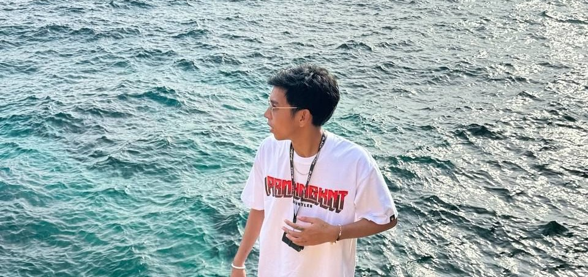

  

  

  

    
  

---

## 💫 About Me
I am an aspiring **Frontend Developer** and passionate **Photographer/Editor** based in the Philippines. I bridge the gap between technical logic and creative design to build seamless digital experiences.

- 🎯 **Focus:** Crafting beautiful, functional web interfaces.
- 📸 **Creative Side:** Deeply into Lightroom & Photoshop post-processing.
- 📚 **Current Goal:** Mastering React.js and deepening Flutter knowledge.
- 💡 **Philosophy:** "Code is art that functions."

---

## 🛠️ Tech Stack

### 💻 Development & Databases

  
  
  
  
  
  

### 🎨 Creative Suite

  
  
  

---

## 📊 Proficiency
| Skill | Level |
| :--- | :--- |
| **HTML / CSS** |  |
| **JavaScript** |  |
| **Java** |  |
| **C#** |  |
| **Dart/Flutter** |  |

---

## 📈 GitHub Analytics

  <table border="0">
    <tr>
      <td></td>
      <td></td>
    </tr>
  </table>
  
  
  
   
  
  

---

## 📫 Connect With Me

  

---

  
  
Built with ❤️ by <strong>Rolan Manales</strong>

